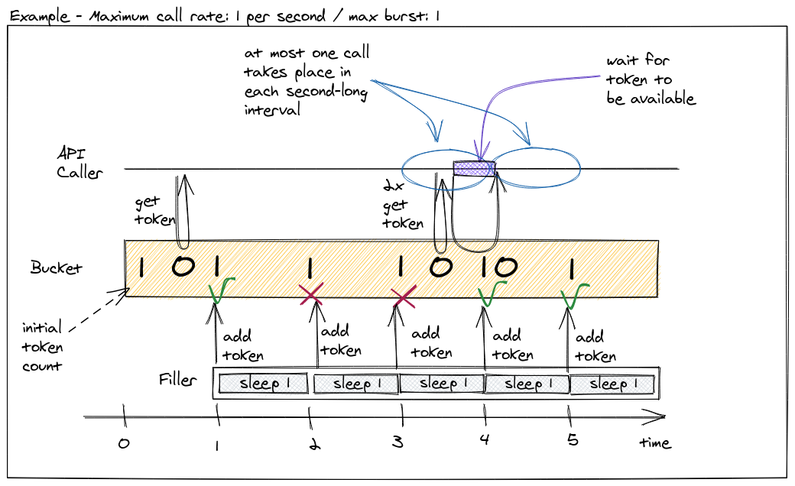

[](https://opensource.org/licenses/MIT)

# rate_limiter

This shard provides a Crystal implementation of the [token bucket](https://en.wikipedia.org/wiki/Token_bucket) algorithm for rate limiting. You can check out the API documentation [here](https://lbarasti.com/rate_limiter/).

## Installation

1 - Add the dependency to your `shard.yml`:

```yaml
dependencies:
  rate_limiter:
    github: lbarasti/rate_limiter
```

2 - Run `shards install`

## Usage

Remember to import the shard at the top of your file.
```crystal
require "rate_limiter"
```

Now you can initialise a rate limiter that produces 1 token every few seconds
```crystal
rl = RateLimiter.new(interval: 3.seconds)
```

Mind that the first call to `#get` will return immediately, as buckets are initialised with 1 token, by default.
```crystal
rl.get # => RateLimiter::Token(2020-11-29 20:36:56 UTC)
```

The next call to `#get` will block for approx. 3 seconds
```crystal
start_time = Time.utc
rl.get
Time.utc - start_time # => 00:00:03.000426843
```

We can also provide a `max_wait` parameter to `#get`.
```crystal
rl.get(0.5.seconds)
```
This call will block for at most 0.5 seconds. If a token is not returned within that interval, then a `RateLimiter::Timeout` is returned.

Rate limiters also expose non-blocking methods.
```crystal
rl.get? # returns `nil` if no token is available

rl.get! # raises a RateLimiter::Timeout exception if no token is available
```

You can pass `#get!` a `max_wait` parameter.
```crystal
rl.get!(1.second)
```
This will raise a `RateLimiter::Timeout` exception if no token is returned within a 1 second interval.

### Burst size
You can define a rate limiter that accumulates unused tokens up to the specified value by providing a `max_burst` parameter to `RateLimiter.new` - the default is 1.
```crystal
RateLimiter.new(rate: 0.5, max_burst: 10)
```
This will generate 1 token every 2 seconds and store up to 10 unused tokens for later use. See Wikipedia's [Burst size](https://en.wikipedia.org/wiki/Token_bucket#Burst_size) for more details.

### Multi-limiters
In the scenario where a part of your code needs to abide to two or more rate limits, you can combine multiple rate limiters into a `MultiLimiter`.

```crystal
api_limiter = RateLimiter.new(rate: 10, max_burst: 60)
db_limiter = RateLimiter.new(rate: 100)
multi = RateLimiter::MultiLimiter.new(api_limiter, db_limiter)
```

You can also use the convenience constructor on the `RateLimiter` module.

```crystal
multi = RateLimiter.new(api_limiter, db_limiter)
```

A `MultiLimiter` exposes the same API as a regular `Limiter` - they both include the `LimiterLike` module - so you can call the same flavours of `#get` methods on it.

When calling `get` on a `MultiLimiter`, it will try to acquire tokens from each one of the underlying rate limiters, and only return a token then.

## Under the hood


## Why do I need a rate limiter?
* We're calling an API that throttles us when we
  call it too frequently, and we'd rather avoid that.
* We are exposing an API to customers and want to
  ensure we don't get flooded with requests. For example, we might want to rate limit calls by client id, so that one misbehaving client will not affect the others.
* One of our ETL stages talks to a datastore that limits the number of requests per second we can send.
* We have to run a database migration in production and we don't
  want to affect the responsiveness of the service.

## Development

Run the following to run the tests.
```
crystal spec
```

## Contributing

1. Fork it (<https://github.com/lbarasti/rate_limiter/fork>)
2. Create your feature branch (`git checkout -b my-new-feature`)
3. Commit your changes (`git commit -am 'Add some feature'`)
4. Push to the branch (`git push origin my-new-feature`)
5. Create a new Pull Request

## Contributors

- [lbarasti](https://github.com/lbarasti) - creator and maintainer
